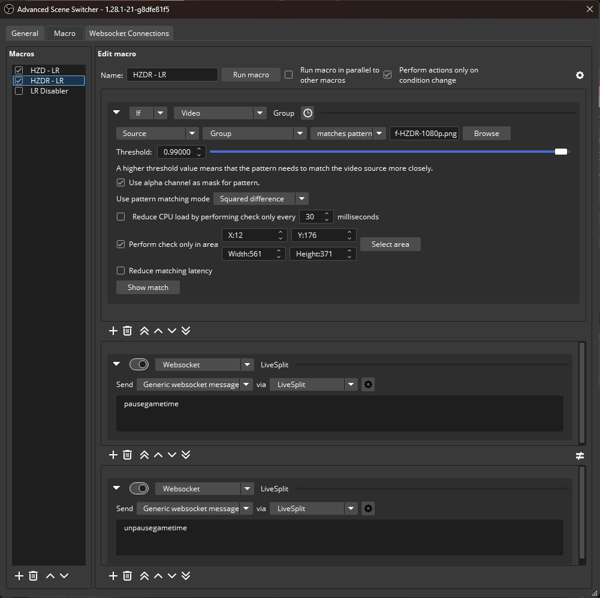

# Horizon Load Remover

This repository provides a OBS-centric approach to video-based load removal for console speedruns for Horizon Zero Dawn and its Remastered version.

The up-to-date rules for Horizon Zero Dawn for the loads that count can be found [here](https://www.speedrun.com/hzd/guides/6atmp). For Remastered it is roughly the same, the load remover in this repository is according to the verification rules for load removal.

This repository only covers the video-based load removal for HZD(R) on console. All PC autosplitters can be found in Livesplit directly and are hosted in a separate repository: [Autosplitters](https://github.com/HorizonSpeedrun/HorizonAutosplitters)

The video-based load removal is based on previous work on the load remover by [Blegas78](https://github.com/blegas78/autoSplitters) and the [description in the SceneSwitcher wiki](https://github.com/WarmUpTill/SceneSwitcher/wiki/Activate-overlay-to-hide-parts-of-the-screen).

## Video-based Load Remover (Console)

Based on previous work on the load remover by [Blegas78](https://github.com/blegas78/autoSplitters) and the [description in the SceneSwitcher wiki](https://github.com/WarmUpTill/SceneSwitcher/wiki/Activate-overlay-to-hide-parts-of-the-screen).

At its core, the new video-based load remover is using the Advanced Scene Switcher plugin in OBS to determine if a loadscreen is active and gives the pause / resume commands to the LiveSplit Server component via a Websocket connection to LiveSplit.

The setup is explained in video form here (including me failing spectacularly in GIMP): [Youtube](https://youtu.be/hogLZuQGPrI)

### Note about Horizon Zero Dawn Remastered

For the Remastered version of Zero Dawn, the Loading screens have a fade out. The start of the fade-out is decided to be the end of the loading, so the image threshold has to be very tight. It is set very close to identical to the reference image (`0.99`), so compression artifacts (or setting the wrong color space) from the capture card can cause the reference image to not be close enough. Please head to the Horizon Discord and post about this issue in #tech-help or try to make your own comparision image. The threshold must not be lowered.

### Note about splitting when no load has occurred since start

When using the OBS based load remover, the game time is only used after the first load. If you split before the first load, you will have a RealTime, but the GameTime of that split will read `-`.

This can happen in the Remastered in NG runs. For now, this behavior will not be changed on LiveSplit's side, because some workflow might depend on the current behavior.

To fix this (it pretty much only affects our load remover), simply activate the game's PC autosplitter in LiveSplit's Splits Editor. We've adapted the autosplitter files to always initialize the GameTime when a new run is started which doesn't affect PC at all.

If you don't have the game set to one of the games (e.g. when doing a multi-game run), and still want this functionality, add a `Scriptable Auto Splitter` to your LiveSplit layout and select the [files/ASL/AlwaysUseGameTime.asl](files/ASL/AlwaysUseGameTime.asl) file. You won't have any indication that the file is loaded correctly in the layout settings, but it'll do its job.

### Prerequistites
* OBS
* [Advanced Scene Switcher Plugin](https://github.com/WarmUpTill/SceneSwitcher/) (1.28.1 or later)
* LiveSplit Version 1.8.30 or later

### Setup
The setup is described for a 1080p source. Scaled sources are possible when they are fed through an extra Scene or Group.

Download the latest Zip archive from the Releases section (or clone the repository). All you need is in the `files` subdirectory.

#### Advanced Scene Switcher

##### Full Settings import
A full export of the settings is available, this includes both the general settings and the macro, be aware that all settings and macros you have made yourself will be overidden by this. If you have other Advanced Scene Switcher macros, the settings are described below, and you can still import the macro only. This import contains all three macros described below (HZD english, HZDR and the disabling macro).
* Download one of the [full settings files](files/import-whole-ADVSS-settings)
* Open the Advanced Scene Switcher Settings by going to Tools -> Advanced Scene Switcher
* In the General Tab click import and select the file you've downloaded.
* After confirming the import, the settings will close, reopen them, go to macros and set the Horizon sources and reference images (see `Macro Import` below; the Websocket connection is included in the full settings files)

Note, that the Websocket server needs to be started manually in the current versions of Livesplit at the time of writing:

`Right-click` -> `Control` -> `Start Websocket Server`

##### General
* Set the advanced Scene Switcher interval to the lowest possible (10ms)

The macro can be set up automatically with most settings set or completely manually.

##### Macro import
* Right click on the macro section and select `Import`
* Paste the string from the corresponding file  into the box
* Select the Horizon source according to your setup
* Select the path to the reference image

For the Zero Dawn Original, the macro is here: [files/import-macros/HZD-1080p-eng.txt](files/import-macros/HZD-1080p-eng.txt)

For the Zero Dawn Remastered, the macro is here: [files/import-macros/HZDR-1080p.txt](files/import-macros/HZDR-1080p.txt)

There is also another macro provided, that disables both macros when OBS is started. This is because having both running can generate a big load on the CPU. Make sure to enable the one for the corresponding game you want to run that session.

That macro is here: [files/import-macros/Automatic-pause-macros.txt](files/import-macros/Automatic-pause-macros.txt)

If you want you can expand on the macros with the other functionalities of ASS and set the macro accordingly to the game that is selected on Twitch for example.

##### Macro manual setup - Horizon Zero Dawn (Original)
* Add a new macro
* Condition:
  * Ensure that `Perform actions only on condition change` is checked
  * Type: Video
  * Select the Source or Scene that shows the gameplay
  * Select `matches pattern` as mode
  * Choose `ref-HZD-1080p.png` as reference
  * Threshold to `0.95`
  * Check the `Use alpha channel as mask` checkbox
  * Pattern matching method `Squared difference`
  * Check area (X, Y, W, H): `99,976,115,25`
* Action branch 1 (if):
  * Type: `Websocket`
  * Select the dropdowns to show:
    * Send: `Generic websocket message`
    * Via: Select `Add new connection` and follow the instructions below in `Websocket Setup`
    * Content: `pausegametime` (no line break)
* Action branch 2 (else):
  * Type: `Websocket`
  * Select the dropdowns to show:
    * Send: `Generic websocket message`
    * Via: Select the previously created `LiveSplit`
    * Content: `unpausegametime` (no line break)

The final macro can be seen here:

##### Macro manual setup - Horizon Zero Dawn Remastered
* Add a new macro
* Condition:
  * Ensure that `Perform actions only on condition change` is checked
  * Type: Video
  * Select the Source or Scene that shows the gameplay
  * Select `matches pattern` as mode
  * Choose `ref-HZDR-1080p.png` as reference
  * Threshold to `0.99`
  * Check the `Use alpha channel as mask` checkbox
  * Pattern matching method `Squared difference`
  * Check area (X, Y, W, H): `12,176,561,371`
* Action branch 1 (if):
  * Type: `Websocket`
  * Select the dropdowns to show:
    * Send: `Generic websocket message`
    * Via: Select `Add new connection` and follow the instructions below in `Websocket Setup`
    * Content: `pausegametime` (no line break)
* Action branch 2 (else):
  * Type: `Websocket`
  * Select the dropdowns to show:
    * Send: `Generic websocket message`
    * Via: Select the previously created `LiveSplit`
    * Content: `unpausegametime` (no line break)

The final macro can be seen here:

#### Websocket Setup
Before setting up the Websocket connection, make sure to open Livesplit and sart the Websocket server
* Right click the Livesplit UI
* Under `Control`, select `Start WebSocket Server`

The Websocket server has to be started manually everytime after starting Livesplit in the current version of Livesplit at the time of writing.

Now, in one of your action branches, in the Websocket dropdown, select `Add new connection`

Add the following values:
* Name: `LiveSplit` (my suggestion)
* Use custom URI: `check`
* Address: `ws://localhost:16834/livesplit`
* Password: doesn't matter, clear textbox
* Connect on startup: leave `checked`
* Reconnect automatically: leave `checked`
* Automatically reconnect after: leave at `3s`
* Use the obs-websocket protocol: clear checkbox `unchecked`
Confirm you've entered the correct settings by presing `Test connection`, it should say `Connected and authenticated` (Future ASS version might changed the message, there's no authentication here)

The websocket popup should look like this:

Select this connection in the action branches or continue setting up the macro

### Implemented resolutions and languages (Original Zero Dawn)

The following table shows the available comparison images and their area settings. The Remastered version is independent from the selected language.

Testing the LR with Remote Play and via Capture Card revealed that the threshold might need to be relaxed to capture the non-default loading screens reliably. Via Capture Card the `Loading...` font was anti-aliased more than on PC and Remote Play (this might be a capture card setting). Because of that a new image was generated.

Try running the beginning of the game with one of these settings:

| Resolution | Language | X | Y | Width | Height | Threshold | Filename |
|---|---|---|---|---|---|---|---|
| 1080p | English | 99 | 976 | 115 | 25 | 0.95 | `ref-HZD-1080p.png` |
| 1080p | English | 99 | 976 | 115 | 25 | 0.95 - 0.97 | `ref-HZD-1080p-capture-card.png` |
| 1080p | German | 99 | 976 | 80 | 21 | 0.97 | `ref-HZD-1080p-german.png` |
| 1080p | Portugese Brasilian | 99 | 976 | 157 | 24 | 0.96 | `ref-HZD-1080p-pt-br.png` |

The first line's settings can directly be imported from the `HZD-1080p-eng.txt` file.

Also, the 1080p versions from the table above can probably be used for other languages, maybe relax the threshold to e.g. `0.92`.

## Troubleshooting

### Nothing works at all

The best way to check this, is by checking what the selected source is capturing. Go to the macro condition and press `Show match`. This will show the part of the image that will be checked for matches. If no part is seen and the shown matching value is showing `nan`, then the source is inactive or the selected area is out of bounds.

Check that the correct source is selected, and that you get cropping visible in the debug screen.

RFS or FT in game and check if the Loading is recognized.

If the rectangle is offset despite using the provided values the reason might be, that scaling applied to the OBS canvas to sources are not recognized by the image capture. If you have a scaled source (e.g. from Remote Play Display Capture on non-1080p screens), add a Group source to OBS, add the scaled source to that Group and select the Group as source for the Load Remover macro. For fine tuning the reference area see the next section

### The normal Loading screen works, but not all of the 4 special ones

For the Remaster, the special loading screens are no longer considered loads because we don't have a way to detect them, and they should be equal in time. If the loading screen is very long, start rebooting the game between runs.

From experience, the start of Proving cutscene loading screen has the worst match with the normal loading screen, so when having set up the LR, the set threshold can be checked by triggering the cutscene and see if the area is recognized. If not, relax the threshold, but you probably don't want to go below `0.91`.

### Changed screen area on Playstation

If you have to adjust the edges of the screen in the Playstation settings (and crop and rescale the capture card image to fit the OBS screen), the area values given here might not hit the correct area.

To fine tune the area of interest select `Show match` in the macro condition and adjust the X and Y so that 2 Pixels to the left and above the `L` of `Loading` are visible.

### Other

If all that did not work, you can capture a screenshot in OBS showing the whole default loading screen and apply the procedure described later or message one of the tool developers on the Horizon Speedruning Discord.

## Generate own comparison image

Each text language, resolution and aspect ratio need its own comparison image.

To create one for your setup follow these instructions (and create a Pull Request here if you want):

### Original Zero Dawn

* Capture a lossless (png) screenshot of the default (fast travel or restart from save) loading screen from your source in the resolution you want to apply the load remover later
* Crop the `Loading` section from the screenshot (without the trailing dots), this crop will also give the area --- Default Paint is surprisingly good for that as it will show the pixel-perfect cropping area that needs to be entered in the Scene Switcher setup
* Open the crop in GIMP (or something else) and use the wand tool to select the surrounding and the inside of `O` s and make these fully transparent
* Save the image as PNG with alpha layer

### Zero Dawn Remastered

* Capture a lossless (png) screenshot of the default (fast travel or restart from save) loading screen from your source in the resolution you want to apply the load remover later
* Crop the section shown in the existing reference images from [the reference folder](reference-images/ref-HZDR-1080p.png) from the screenshot, if you are using a 1080p source use the very same boundaries (default Paint lets you select it pixel-perfectly).

# License

This repository is provided under MIT license. See [LICENSE.md](/LICENSE.md)
